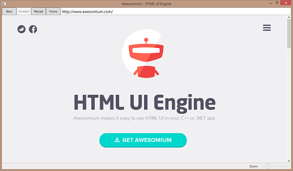

In this walkthrough you create a browser-like WPF application that uses the Awesomium WPF `WebControl` to render web content, as well as supporting WPF components provided by *`Awesomium.Windows.Controls`*.

> For details about the usage of the WPF `WebControl` and additional Awesomium WPF components, read: [Using the WPF WebControl](webcontrol.html)

In this walkthrough, you perform the following tasks:

* Create a WPF application that uses Awesomium.
* Initialize the Awesomium `WebCore`.
* Create a window to host a WPF `WebControl`.
* Create the UI to be bound to the `WebControl`.
* Handle important `WebControl` events.
* Test Awesomium WPF features.

### Prerequisites

You need the following components to complete this walkthrough:

* Awesomium SDK (available [here](http://www.awesomium.com/download/))
* Visual Studio (2013, 2012 or 2010, Express or full edition)

### Create a WPF application that uses Awesomium

**To create the project**

1. In Visual Studio, hit **New Project** and in the New Project dialog make sure the target framework is **NET Framework 4.0** (Full or Client Profile) **or newer**.
2. Create a new **WPF Application** project in Visual Basic or Visual C# named **StarterSample**.
3. Open the project's properties window and in the **Build** tab (for Visual C#) or the **Compile** tab (for Visual Basic), make sure your project targets **x86**.
4. Add a reference to the following assemblies:
    * *`Awesomium.Core`*
    * *`Awesomium.Windows.Controls`*

    In the **Reference Manager** dialog, you should be able to find the assemblies under Assemblies -> Extensions.

5. In **Solution Explorer**, change the name of the application's main window to **MainWindow.xaml**.

### Initialize the Awesomium WebCore

In this procedure you explicitly initialize the Awesomium [`WebCore`](http://docs.awesomium.net/?tc=T_Awesomium_Core_WebCore). The WebCore manages the creation and lifetime of all IWebView and WebSession instances and maintains useful services like:

 * Auto-Update
 * Network stack
 * Inter-process messaging
 * Surface creation
 * Download operations

Generally, you should initialize the `WebCore` providing your custom configuration settings, before creating any views and shut it down at the end of your program.

> If you do not explicitly initialize the `WebCore`, the core will automatically start, using default configuration settings, when you create the first [`IWebView`](../general-use/introduction-to-web-views.html) instance or when you create the first [`WebSession`](../general-use/using-web-sessions.html).

**To initialize and shutdown the WebCore**

1. Open the *`App.xaml.cs`* or *`Application.xaml.vb`* file.
2. Add the following namespaces to the top of the file. Replace the existing ones if there are any.

    
    using System;
    using System.Linq;
    using Awesomium.Core;
    using System.Windows;
    using System.Collections.Generic;
    

3. Override the `OnStartup` method. This is where you explicitly initialize the `WebCore`.

  
  protected override void OnStartup( StartupEventArgs e )
  {
      // Initialization must be performed here,
      // before creating a WebControl.
      if ( !WebCore.IsInitialized )
        {
          WebCore.Initialize( new WebConfig()
          {
              HomeURL = "https://www.awesomium.com".ToUri(),
              LogPath = @".\starter.log",
              LogLevel = LogLevel.Verbose
          } );
      }

      base.OnStartup( e );
  }
  

4. Override the `OnExit` method. This is where you shutdown the `WebCore`.

  
  protected override void OnExit( ExitEventArgs e )
  {
      // Make sure we shutdown the core last.
      if ( WebCore.IsInitialized )
          WebCore.Shutdown();

      base.OnExit( e );
  }
  

5. Save changes and close the file.

### Create a Window to host WPF WebControl.

In this procedure you edit the application's main `Window` to create a window that will host the WPF `WebControl` and supporting UI. This window will be used as the application's main window, as well as a child (popup) window for displaying external links and JavaScript *`window.open`* calls.

**To create the window**

1. Open the *`MainWindow.xaml.cs`* or *`MainWindow.xaml.vb`* code file.

  The file opens in the Code Editor.
2. Add the following namespaces to the top of the file. Replace the existing ones if there are any.

  
  using System;
  using System.Linq;
  using System.Windows;
  using Awesomium.Core;
  using Awesomium.Windows.Controls;
  using System.Collections.Generic;
  

3. Add the following dependency properties to the file, after the constructor that is automatically added by Visual Studio.

  
  // This will be set to the target URL, when this window does not
  // host a created child view. The WebControl, is bound to this property.
  public Uri Source
  {
      get { return (Uri)GetValue( SourceProperty ); }
      set { SetValue( SourceProperty, value ); }
  }
  
  // Identifies the <see cref="Source"/> dependency property.
  public static readonly DependencyProperty SourceProperty =
      DependencyProperty.Register( "Source",
      typeof( Uri ), typeof( MainWindow ),
      new FrameworkPropertyMetadata( null ) );
  
  
  // This will be set to the created child view that the WebControl will wrap,
  // when ShowCreatedWebView is the result of 'window.open'. The WebControl, 
  // is bound to this property.
  public IntPtr NativeView
  {
      get { return (IntPtr)GetValue( NativeViewProperty ); }
      private set { this.SetValue( MainWindow.NativeViewPropertyKey, value ); }
  }
  
  private static readonly DependencyPropertyKey NativeViewPropertyKey =
      DependencyProperty.RegisterReadOnly( "NativeView",
      typeof( IntPtr ), typeof( MainWindow ),
      new FrameworkPropertyMetadata( IntPtr.Zero ) );
  
  // Identifies the <see cref="NativeView"/> dependency property.
  public static readonly DependencyProperty NativeViewProperty =
      NativeViewPropertyKey.DependencyProperty;
  
  // The visibility of the address bar and status bar, depends
  // on the value of this property. We set this to false when
  // the window wraps a WebControl that is the result of JavaScript
  // 'window.open'.
  public bool IsRegularWindow
  {
      get { return (bool)GetValue( IsRegularWindowProperty ); }
      private set { this.SetValue( MainWindow.IsRegularWindowPropertyKey, value ); }
  }
  
  private static readonly DependencyPropertyKey IsRegularWindowPropertyKey =
      DependencyProperty.RegisterReadOnly( "IsRegularWindow",
      typeof( bool ), typeof( MainWindow ),
      new FrameworkPropertyMetadata( true ) );
  
  // Identifies the <see cref="IsRegularWindow"/> dependency property.
  public static readonly DependencyProperty IsRegularWindowProperty =
      IsRegularWindowPropertyKey.DependencyProperty;
  

4. Save the file and close the Code Editor of `MainWindow`.

### Create the UI to be bound to the WebControl

In this procedure you create the user interface of the application's main `Window`. The interface includes the WPF `WebControl` and supporting elements that bind to actions of the `WebControl`, as well as a [`WebSessionProvider`](http://docs.awesomium.net/?tc=T_Awesomium_Windows_Controls_WebSessionProvider) that allows you to assign a `WebSession` with certain preferences to the `WebControl`.

This window will be used as the application's main window, as well as a child (popup) window for displaying external links and JavaScript *`window.open`* calls.

**To create the UI**

1. In XAML view for **_`MainWindow.xaml`_**, replace the existing XAML with the following:

  
  <Window 
      x:Name="webWindow"
      x:Class="StarterSample.MainWindow" 
      xmlns="http://schemas.microsoft.com/winfx/2006/xaml/presentation" 
      xmlns:x="http://schemas.microsoft.com/winfx/2006/xaml" 
      xmlns:awe="http://schemas.awesomium.com/winfx"
      xmlns:data="http://schemas.awesomium.com/winfx/data"
      xmlns:core="clr-namespace:Awesomium.Core;assembly=Awesomium.Core"
      WindowStartupLocation="CenterScreen"
      Title="{Binding Title, ElementName=webControl}"
      Height="700" 
      Width="1200">
      <Window.Resources>
          <awe:WebSessionProvider x:Key="webSession" DataPath=".\Cache">
              <core:WebPreferences 
                  ShrinkStandaloneImagesToFit="False"
                  SmoothScrolling="True" />
          </awe:WebSessionProvider>
  
          <awe:UrlConverter x:Key="UrlConverter" />
          <BooleanToVisibilityConverter x:Key="booleanToVisibilityConverter" />
      </Window.Resources>
      <awe:WebDialogsLayer>
          <Grid>
              <Grid.RowDefinitions>
                  <RowDefinition Height="Auto"/>
                  <RowDefinition />
                  <RowDefinition Height="Auto" />
              </Grid.RowDefinitions>
              <DockPanel 
                  LastChildFill="True" 
                  Height="30"
                  Visibility="{Binding IsRegularWindow, ElementName=webWindow, 
                               Converter={StaticResource booleanToVisibilityConverter}}">
                  <Button 
                      Content="Back" 
                      Width="60" 
                      Command="{x:Static NavigationCommands.BrowseBack}" 
                      CommandTarget="{Binding ElementName=webControl}"/>
                  <Button 
                      Content="Forward" 
                      Width="60" 
                      Command="{x:Static NavigationCommands.BrowseForward}" 
                      CommandTarget="{Binding ElementName=webControl}"/>
                  <Button 
                      Content="Reload" 
                      Width="60" 
                      Command="{x:Static NavigationCommands.Refresh}" 
                      CommandParameter="False"
                      CommandTarget="{Binding ElementName=webControl}"/>
                  <Button 
                      Content="Home" 
                      Width="60" 
                      Command="{x:Static NavigationCommands.BrowseHome}"
                      CommandTarget="{Binding ElementName=webControl}"/>
                  <TextBox 
                      FontSize="16"
                      Padding="3,0"
                      VerticalContentAlignment="Center"
                      TextWrapping="NoWrap"
                      Text="{data:SourceBinding webControl}" />
              </DockPanel>
              <awe:WebControl 
                  Grid.Row="1"
                  x:Name="webControl"
                  NativeView="{Binding NativeView, ElementName=webWindow}"
                  WebSession="{Binding Source={StaticResource webSession}}"
                  Source="{Binding Source, ElementName=webWindow}"/>
              <StatusBar
                  Grid.Row="2" 
                  Height="25" 
                  BorderBrush="{DynamicResource {x:Static SystemColors.ActiveBorderBrushKey}}" 
                  BorderThickness="0,1,0,0"
                  Visibility="{Binding IsRegularWindow, ElementName=webWindow,
                               Converter={StaticResource booleanToVisibilityConverter}}">
                  <StatusBarItem>
                      <TextBlock 
                          VerticalAlignment="Center" 
                          Padding="3" 
                          TextWrapping="NoWrap" 
                          TextTrimming="CharacterEllipsis" 
                          Text="{Binding TargetURL, ElementName=webControl, 
                                 Converter={StaticResource UrlConverter}}"/>
                  </StatusBarItem>
                  <StatusBarItem HorizontalAlignment="Right">
                      <StackPanel Orientation="Horizontal">
                          <TextBlock 
                              VerticalAlignment="Center"
                              Margin="7,0" 
                              Text="Zoom:"/>
                          <Slider 
                              DataContext="{Binding ElementName=webControl}" 
                              Margin="3,0" 
                              Minimum="10" 
                              Maximum="400" 
                              Width="120"
                              VerticalAlignment="Center" 
                              Value="{Binding Zoom}" 
                              AutoToolTipPlacement="TopLeft" 
                              IsSnapToTickEnabled="True" 
                              IsMoveToPointEnabled="True" 
                              SmallChange="1" 
                              LargeChange="10" 
                              TickFrequency="10" 
                              Focusable="False" 
                              ToolTip="{Binding Zoom}">
                              <Slider.ContextMenu>
                                  <ContextMenu DataContext="{Binding PlacementTarget.DataContext, 
                                               RelativeSource={RelativeSource Self}}">
                                      <MenuItem Command="{x:Static awe:WebControlCommands.ResetZoom}"
                                                CommandTarget="{Binding}" />
                                  </ContextMenu>
                              </Slider.ContextMenu>
                          </Slider>
                      </StackPanel>
                  </StatusBarItem>
              </StatusBar>
          </Grid>
      </awe:WebDialogsLayer>
  </Window>
  

2. Save and close the file.

For details about designing the contents of the window, please read the following articles:

* [Using the WPF WebControl](webcontrol.html)
* [Using the WebSessionProvider](websessionprovider.html)
* [Using DataSourceProviders](datasourceprovider.html)
* [How to: Create WPF UI that binds to WebControl actions](howto-ui.html)
* [How to: Create a WPF TextBox that acts as an Address-Box](howto-addressbox.html)

### Handle important WebControl events

In this procedure, you assign handlers to some important `WebControl` events. For more information, also see:

* [Introduction to Web-Views - Handling Events](../general-use/introduction-to-web-views.html)
* [Web-View Initialization Sequence](../general-use/initialization-sequence.html)

> You can also assign event handlers in XAML as demonstrates in most samples. In this example, we assign them programmatically.

**To assign event handlers**

1. Open the *`MainWindow.xaml.cs`* or *`MainWindow.xaml.vb`* code file.

  The file opens in the Code Editor.
2. In the Code Editor, locate the default constructor for the `MainWindow` class. It should look like the following:

  
  public MainWindow()
  {
      InitializeComponent();
  }
  

3. Edit the default constructor, adding the following code:

  
  public MainWindow()
  {
      InitializeComponent();
  
      // Always handle ShowCreatedWebView. This is fired for
      // links and forms with |target="_blank"| or for JavaScript
      // 'window.open' calls.
      webControl.ShowCreatedWebView += webControl_ShowCreatedWebView;
      webControl.LoadingFrameComplete += OnLoadingComplete;
      // Start with the specified Home URL.
      this.Source = WebCore.Configuration.HomeURL;
  }
  

4. Create another constructor accepting an `IntPtr` parameter. This constructor will be used for showing child views that are the result of JavaScript *`window.open`* or of an HTML `form` with `method="post"` and `target="_blank"`.

  
  public MainWindow( IntPtr nativeView )
  {
      InitializeComponent();
  
      // Always handle ShowCreatedWebView. This is fired for
      // links and forms with |target="_blank"| or for JavaScript
      // 'window.open' calls.
      webControl.ShowCreatedWebView += webControl_ShowCreatedWebView;
      // For popups, you usually want to handle WindowClose,
      // fired when the page calls 'window.close'.
      webControl.WindowClose += webControl_WindowClose;
      // Tell the WebControl that it should wrap a created child view.
      this.NativeView = nativeView;
      // This window will host a WebControl that is the result of 
      // JavaScript 'window.open'. Hide the address and status bar.
      this.IsRegularWindow = false;
  }
  

**For details, read the Remarks section of: [`ShowCreatedWebView`](http://docs.awesomium.net/?tc=E_Awesomium_Core_IWebView_ShowCreatedWebView).**

5. Create another constructor accepting a `Uri` parameter. This constructor will be used for showing child views that are the result of links with `target="_blank"`.

  
  public MainWindow( Uri url )
  {
      InitializeComponent();
  
      // Always handle ShowCreatedWebView. This is fired for
      // links and forms with |target="_blank"| or for JavaScript
      // 'window.open' calls.
      webControl.ShowCreatedWebView += webControl_ShowCreatedWebView;
      // For popups, you usually want to handle WindowClose,
      // fired when the page calls 'window.close'.
      webControl.WindowClose += webControl_WindowClose;
      // Tell the WebControl to load a specified target URL.
      this.Source = url;
  }
  

**For details, read the Remarks section of: [`ShowCreatedWebView`](http://docs.awesomium.net/?tc=E_Awesomium_Core_IWebView_ShowCreatedWebView).**

6. At the bottom of the file, add the definition of the event handlers.

  
  private void webControl_ShowCreatedWebView( object sender, ShowCreatedWebViewEventArgs e )
  {
      if ( webControl == null )
          return;
  
      if ( !webControl.IsLive )
          return;
  
      // An instance of our application's web window, 
      // that will host the new view instance, either 
      // we wrap the created child view, or we let the 
      // WebControl create a new underlying web-view.
      MainWindow newWindow;
  
      // Treat popups differently. If IsPopup is true, 
      // the event is always the result of 'window.open' 
      // (IsWindowOpen is also true, so no need to check it).
      // Our application does not recognize user defined, 
      // non-standard specs. Therefore child views opened 
      // with non-standard specs, will not be presented as 
      // popups but as regular new windows (still wrapping 
      // the child view however -- se below).
      if ( e.IsPopup && !e.IsUserSpecsOnly )
      {
          // JSWindowOpenSpecs.InitialPosition indicates screen coordinates.
          Int32Rect screenRect = e.Specs.InitialPosition.GetInt32Rect();
  
          // Set the created native view as the underlying view of the
          // WebControl. This will maintain the relationship between
          // the parent view and the child, usually required when the 
          // new view is the result of 'window.open' (JS can access 
          // the parent window through 'window.opener'; the parent window 
          // can manipulate the child through the 'window' object returned 
          // from the 'window.open' call).
          newWindow = new MainWindow( e.NewViewInstance );
          // Do not show in the taskbar.
          newWindow.ShowInTaskbar = false;
          // Set a border-style to indicate a popup.
          newWindow.WindowStyle = WindowStyle.ToolWindow;
          // Set resizing mode depending on the indicated specs.
          newWindow.ResizeMode = e.Specs.Resizable ? 
              ResizeMode.CanResizeWithGrip : 
              ResizeMode.NoResize;
  
          // If the caller has not indicated a valid size for the 
          // new popup window, let it be opened with the default 
          // size specified at design time.
          if ( ( screenRect.Width > 0 ) && ( screenRect.Height > 0 ) )
          {
              // The indicated size, is client size.
              double horizontalBorderHeight = 
                  SystemParameters.ResizeFrameHorizontalBorderHeight;
              double verticalBorderWidth = 
                  SystemParameters.ResizeFrameVerticalBorderWidth;
              double captionHeight = 
                  SystemParameters.CaptionHeight;
  
              // Set the indicated size.
              newWindow.Width = screenRect.Width + 
                  ( verticalBorderWidth * 2 );
              newWindow.Height = screenRect.Height + 
                  captionHeight + 
                  ( horizontalBorderHeight * 2 );
          }
  
          // Show the window.
          newWindow.Show();
  
          // If the caller has not indicated a valid position for 
          // the new popup window, let it be opened in the default 
          // position specified at design time.
          if ( ( screenRect.Y > 0 ) && ( screenRect.X > 0 ) )
          {
              // Move it to the indicated coordinates.
              newWindow.Top = screenRect.Y;
              newWindow.Left = screenRect.X;
          }
      }
      else if ( e.IsWindowOpen || e.IsPost )
      {
          // No specs or only non-standard specs were specified, 
          // but the event is still the result of 'window.open' 
          // or of an HTML form with tagret="_blank" and method="post".
          // We will open a normal window but we will still wrap 
          // the new native child view, maintaining its relationship 
          // with the parent window.
          newWindow = new MainWindow( e.NewViewInstance );
          // Show the window.
          newWindow.Show();
      }
      else
      {
          // The event is not the result of 'window.open' or of an 
          // HTML form with tagret="_blank" and method="post"., 
          // therefore it's most probably the result of a link with 
          // target='_blank'. We will not be wrapping the created view; 
          // we let the WebControl hosted in MainWindow create its own 
          // underlying view. Setting Cancel to true tells the core 
          // to destroy the created child view.
          //
          // Why don't we always wrap the native view passed to 
          // ShowCreatedWebView?
          //
          // - In order to maintain the relationship with their parent 
          // view, child views execute and render under the same process 
          // (awesomium_process) as their parent view. If for any reason 
          // this child process crashes, all views related to it will be 
          // affected. When maintaining a parent-child relationship is not 
          // important, we prefer taking advantage of the isolated process 
          // architecture of Awesomium and let each view be rendered in 
          // a separate process.
          e.Cancel = true;
          // Note that we only explicitly navigate to the target URL, 
          // when a new view is about to be created, not when we wrap the 
          // created child view. This is because navigation to the target 
          // URL (if any), is already queued on created child views. 
          // We must not interrupt this navigation as we would still be 
          // breaking the parent-child relationship.
          newWindow = new MainWindow( e.TargetURL );
          // Show the window.
          newWindow.Show();
      }
  }
  
  private void webControl_WindowClose( object sender, WindowCloseEventArgs e )
  {
      // The page called 'window.close'. If the call
      // comes from a frame, ignore it.
      if ( !e.IsCalledFromFrame )
          this.Close();
  }
  

7. Save the file and close the Code Editor of `MainWindow`.

### Test Awesomium WPF features

**To test the application**

1. On the **Build** menu, click **Build Solution**.
2. On the **Debug** menu, click **Start Debugging**.

  The application starts and the window appears. It should look like this:

  

**To test Awesomium features**

1. Hover over links in the opened page and see the target URL in the **status-box**.
2. Right-click the in the page, on links and finally on Awesomium's logo, to see the predefined [`WebControlContextMenu`](http://docs.awesomium.net/?tc=T_Awesomium_Windows_Controls_WebControlContextMenu).

  The items of the menu change depending on the context. When you right-click the logo, you are also given an option to download and **save the image**.
2. Click in the **address-box**.

  The current contents of the address-box will be automatically selected. This is a feature of the [`SourceBinding`](http://docs.awesomium.net/?tc=T_Awesomium_Windows_Data_SourceBinding) markup extension used to bind the address-box with the WebControl's `Source`.
3. Type the following address and hit **Enter** to navigate to it:

  [http://jsfiddle.net/awesomium/SZmMj/](http://jsfiddle.net/awesomium/SZmMj/)

4. Follow the instructions in the **Result** frame to test child windows and JavaScript dialog boxes.

  Dialogs are presented by the [`WebDialogsLayer`](http://docs.awesomium.net/?tc=T_Awesomium_Windows_Controls_WebDialogsLayer) container.
5. Using the address-box again, navigate to the following address:

  [http://awesomium.net/samples/select_test.html](http://awesomium.net/samples/select_test.html)

  Test the HTML `select` box that shows a list of countries, devided in groups. The drop-down (popup) list is shown using the predefined [`WebPopupMenu`](http://docs.awesomium.net/?tc=T_Awesomium_Windows_Controls_WebPopupMenu).
6. Use the slider in the **status-box** to zoom in and out the currently loaded page.

  Zoom setting is applied to the current domain and is persisted for the current session.
7. Close all open window to exit the application.

### See Also

#### Other Resources

* [Using the WPF WebControl](webcontrol.html)
* [Using the WebSessionProvider](websessionprovider.html)
* [Using DataSourceProviders](datasourceprovider.html)

#### Tasks 

* [How to: Create WPF UI that binds to WebControl actions](howto-ui.html)
* [How to: Create a WPF TextBox that acts as an Address-Box](howto-addressbox.html)
