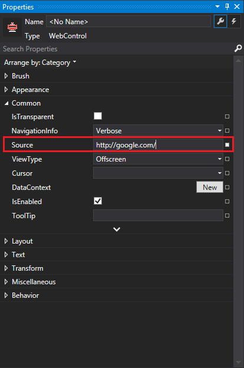

[external]: data:image/png;base64,iVBORw0KGgoAAAANSUhEUgAAAAoAAAAKCAYAAACNMs+9AAAAVklEQVR4Xn3PgQkAMQhDUXfqTu7kTtkpd5RA8AInfArtQ2iRXFWT2QedAfttj2FsPIOE1eCOlEuoWWjgzYaB/IkeGOrxXhqB+uA9Bfcm0lAZuh+YIeAD+cAqSz4kCMUAAAAASUVORK5CYII=

### Index

* [Introduction](#introduction)
* [Creating a WebControl](#creating_a_webcontrol)
  * [Create in XAML](#create_in_xaml)
  * [Create at Runtime](#create_at_runtime)
* [Initialization](#initialization)
  * [Summary](#summary)
  * [WebCore Initialization](#webcore_initialization)
  * [Example](#example)
* [Loading Content](#loading_content)
  * [Loading Content at Runtime](#loading_content_at_runtime)
  * [Loading Resources](#loading_resources)
* [Rendering](#rendering)
  * [Presenters](#presenters)
  * [WebViewPresenter](#webviewpresenter)
      * [Pixel Buffer](#pixel_buffer_1)
      * [User Input](#user_input_1)
  * [WebViewHost](#webviewhost)
      * [Pixel Buffer](#pixel_buffer_2)
      * [User Input](#user_input_2)
  * [Hardware Acceleration](#hardware_acceleration)
  * [Using WPF Presenters with a WebView](#using_wpf_presenters_with_a_webview)
* [Offscreen vs Windowed in WPF](#offscreen_vs_windowed_in_wpf)
* [UI Integration](#ui_integration)
  * [Routed Commands](#routed_commands)
  * [Predefined Controls](#predefined_controls)
  * [Utilities](#utilities)
* [Customizations](#customizations)
  * [Customizing the Context Menu](#customizing_the_context_menu)
  * [Customizing Popup Menus](#customizing_popup_menus)
  * [Customizing Dialogs](#customizing_dialogs)
* [Additional Resources](#additional_resources)

### Introduction

The **WPF** [`WebControl`](http://docs.awesomium.net/?tc=T_Awesomium_Windows_Controls_WebControl) is our official WPF wrapper of an Awesomium Web-View.

The WPF `WebControl` is available through the **_Awesomium.Windows.Controls_** assembly and provides WPF developers with a ready to use, **drag-and-drop, standalone WPF control** that handles all the basic embedding tasks (mouse/keyboard input, rendering, resizing, cursors, focusing, etc.) and various utilities that can help WPF developers take advantage of all Awesomium features.

### Creating a WebControl

When you install the [Awesomium SDK](http://www.awesomium.com/download/) ![][external], the WPF `WebControl` is automatically added to Visual Studio's Toolbox. You should be able to see it under the **Awesomium.NET** toolbox tab when a `Window` or `Control` is open in the WPF designer.

> If you cannot find the `WebControl` or the *Awesomium.NET* tab in your toolbox, please read: [Visual Studio Toolbox](../getting-started/setting-up-on-windows.html#visual_studio_toolbox).

All you have to do is **drag and drop the `WebControl` from the Toolbox to your container in the designer, or in XAML**. The appropriate references will automatically be added to your project.

> To easily make the control fill its container, right-click the control in the designer and from the context menu select: **Reset Layout > All**

#### Create in XAML

If you want to add a `WebControl` directly in XAML without using the Toolbox, you will have to **make sure your project references the following assemblies**:

* *`Awesomium.Core.dll`*
* *`Awesomium.Windows.Controls.dll`*

Then, in XAML, add the appropriate XAML Namespace and the `WebControl`, like this:


<Window 
    x:Class="WpfApplication1.MainWindow" 
    xmlns="http://schemas.microsoft.com/winfx/2006/xaml/presentation" 
    xmlns:x="http://schemas.microsoft.com/winfx/2006/xaml"
    xmlns:osm="http://schemas.awesomium.com/winfx"
    Height="480" 
    Width="640">
    <osm:WebControl Name="webControl" />
</Window>


#### Create at Runtime

You can create a `WebControl` at runtime and add it to the visual tree, just as you would with any other WPF control.

**WebControls created programmatically will not initialize and wrap a native web-view, until they are added to the visual tree and loaded for presentation**. This allows you to set properties that can only be set when the view is not yet *alive* (see [`IsLive`](http://docs.awesomium.net/?tc=P_Awesomium_Windows_Controls_WebControl_IsLive)), right after creating the `WebControl`, but also poses some limitations. For details, read the **[Initialization](#initialization)** section below.

### Initialization

It is important to understand the sequence of events that occur when a native web-view is being wrapped by an Awesomium.NET component, such as the WPF `WebControl`. The WPF `WebControl`, will not initialize and wrap a native web-view until it is added to the visual tree and loaded for presentation. This means that you cannot perform actions against the native web-view instance (see [`IWebView`](http://docs.awesomium.net/?tc=T_Awesomium_Core_IWebView)), until the `WebControl` is loaded for presenation and [`IsLive`](http://docs.awesomium.net/?tc=P_Awesomium_Windows_Controls_WebControl_IsLive) is `true`.

Below is a list of events in the Awesomium.NET API, that are being fired once during the initialization of all `IWebView` instances, in that order:

1. [`IWebView.InitializeView`](http://docs.awesomium.net/?tc=E_Awesomium_Core_IWebView_InitializeView): Fired right before a native web-view is wrapped. This is the last moment that properties that cannot be changed when [`IsLive`](http://docs.awesomium.net/?tc=P_Awesomium_Windows_Controls_WebControl_IsLive) is `true`, can be set.
2. [`WebCore.CreatedView`](http://docs.awesomium.net/?tc=E_Awesomium_Core_WebCore_CreatedView): Fired when the new Web-View component is added to the [`WebCore.Views`](http://docs.awesomium.net/?tc=P_Awesomium_Core_WebCore_Views) collection.
3. [`IWebView.NativeViewInitialized`](http://docs.awesomium.net/?tc=E_Awesomium_Core_IWebView_NativeViewInitialized): Fired after the native web-view is created, initialization is complete and settings have been applied to view.
4. [`IWebView.ProcessCreated`](http://docs.awesomium.net/?tc=E_Awesomium_Core_IWebView_ProcessCreated): Fired when it’s certain that the child process of the view (*`awesomium_process`*), has been started. This is usually when the first page starts loading.

The complete initialization sequence of the WPF `WebControl`, helps you decide the moment certain operations can be performed on the component.

**For the complete sequence, read [Web-View Initialization Sequence - WPF WebControl Component](http://wiki.awesomium.net/general-use/initialization-sequence.html#wpf-webcontrol)**.

#### Summary

To summarize, the following list provides some guidance of how to manually create and/or initialize your `WebControl`:

1. If you need to programmatically create a `WebControl`, do so right after the `IntializeComponent` method call, inside your container's constructor.
2. To initialize your `WebControl`, do so in any of the following places:
    * In the designer, by setting properties in XAML or by selecting the control and using the Properties window. `WebControl` properties in the Properties window, are properly categorized.
    * In code, right after its creation (if the control was created programmatically. - See above).
    * In code, right after the `InitializeComponent` method call inside your container's constructor. This also applies for controls created in the designer or XAML. Settings applied at this point, will of course override the settings of properties set in the designer (which are applied during `InitializeComponent`).
    * Inside a [`WebControl.InitializeView`](http://docs.awesomium.net/?tc=E_Awesomium_Windows_Controls_WebControl_InitializeView) event handler. This is the last event fired before the native web-view is created and initialization settings are applied to it. You can set a handler for `InitializeView` in either the designer/XAML, or right after the `InitializeComponent` method call inside your container's constructor.
3. To access members of the native [`IWebView`](http://docs.awesomium.net/?tc=T_Awesomium_Core_IWebView) instance, do so in any of the following moments:
    * After the [`WebControl.NativeViewInitialized`](http://docs.awesomium.net/?tc=E_Awesomium_Windows_Controls_WebControl_NativeViewInitialized) event is fired.
    * After [`IsLive`](http://docs.awesomium.net/?tc=P_Awesomium_Windows_Controls_WebControl_IsLive) is `true`. `IsLive` is a `DependencyProperty` and you can easily check its status in both code and XAML (with `Triggers`).
4. To execute JavaScript on a loaded page, do so right after the [`WebControl.DocumentReady`](http://docs.awesomium.net/?tc=E_Awesomium_Windows_Controls_WebControl_DocumentReady) event is fired. This is the case for all subsequent navigations after the initial one, if any.

> To easily access your `WebControl` programmatically, make sure you set a **`Name`** for it in the designer/XAML.

**For a complete example, see the [Example](#example) section below**.

#### WebCore Initialization

If you need to explicitly initialize the Awesomium [`WebCore`](http://docs.awesomium.net/?tc=T_Awesomium_Core_WebCore) in a WPF application using WebControls, you can do so in any of the following places:

* Inside an [`Application.Startup`](http://msdn.microsoft.com/en-us/library/system.windows.application.startup.aspx) ![][external] event handler, in your *`App.xaml.cs`* (or *`Application.xaml.vb`* in Visual Basic) code file.
* Inside an [`Application.OnStartup`](http://msdn.microsoft.com/en-us/library/system.windows.application.onstartup.aspx) ![][external] override, before or after calling the base method.
* **Before** the `InitializeComponent` method call inside your main window's constructor.

Irrespective of the place you choose, make sure that you use the [`WebCore.Initialize(WebConfig)`](http://docs.awesomium.net/?tc=M_Awesomium_Core_WebCore_Initialize) overload, that only accepts a [`WebConfig`](http://docs.awesomium.net/?tc=T_Awesomium_Core_WebConfig). This method performs lazy initialization which means that the core will actually be initialized when the first view or `WebSession` are created.

**For details, read the [WebCore Initialization](../general-use/webcore-initialization.html) article**.

> If you choose to initialize the `WebCore` before the `InitializeComponent` method call inside your main window's constructor, **make sure that your code checks for [`WebCore.IsInitialized`](http://docs.awesomium.net/?tc=P_Awesomium_Core_WebCore_IsInitialized) before attempting to call [`WebCore.Initialize`](http://docs.awesomium.net/?tc=M_Awesomium_Core_WebCore_Initialize)**. Your application may create more than one instances of your main window but **the Awesomium `WebCore` can only be initialized once**. Attempting to call [`WebCore.Initialize`](http://docs.awesomium.net/?tc=M_Awesomium_Core_WebCore_Initialize) when the `WebCore` is already initialized and running, will throw an exception.

**For a complete example, see the [Example](#example) section below**.

#### Example

### Loading Content

The primary way to load content into any `IWebView` instance, is via the [`Source`](http://docs.awesomium.net/?tc=P_Awesomium_Core_IWebView_Source) property. For example, to begin navigating a WPF `WebControl` to Google, select the `WebControl` in the WPF designer and in the **Properties** window, set the **`Source`** property:

Likewise in XAML:


<Window 
    x:Class="WpfApplication1.MainWindow" 
    xmlns="http://schemas.microsoft.com/winfx/2006/xaml/presentation" 
    xmlns:x="http://schemas.microsoft.com/winfx/2006/xaml"
    xmlns:osm="http://schemas.awesomium.com/winfx"
    Height="480" 
    Width="640">
    <osm:WebControl 
        Name="webControl"
        Source="http://www.google.com/" />
</Window>


> It is practically easier to set the **`Source`** property in the **Properties** window rather than directly in XAML. If you type just *google.com* in the **Properties** window, we automatically add the *`http://`* protocol for you.

#### Loading Content at Runtime

At runtime, you can navigate to a new address anytime, still by setting the `Source` property. The property accepts a `Uri` but we have provided some extensions that make it easy to pass a string:


using Awesomium.Core;

[...]

webControl.Source = "http://www.awesomium.com".ToUri();


> *`ToUri`* will return a blank URI (`about:blank`), if the string does not represent a properly formatted URI.

#### Loading Resources

`WebControl.Source` makes it really easy to load remote content on the Internet, but what about local resources? If you would like to load local resources with your application, we recommend using a [`DataSource`](http://docs.awesomium.net/?tc=T_Awesomium_Core_Data_DataSource). This powerful bit of API allows you to provide a custom resource loader for a set of URLs that match a certain prefix.

> See [this article](../general-use/using-data-sources.html) for an introduction to `DataSource` and the available, predefined `DataSource` classes that come with Awesomium.NET.

In WPF, we provide a `WebSession` provider (see [Using Web-Sessions](../general-use/using-web-sessions.html)) and `DataSource` providers for all the available Awesomium.NET `DataSource` classes, that can be used in XAML.

**For details, read the [Using DataSource Providers](using-datasource-providers.html) article.**

### Rendering

The WPF `WebControl` supports both *offscreen* and *windowed* rendering (for details, read [Introduction to Web-Views](../general-use/introduction-to-web-views.html)).

The rendering mode is defined by setting the [`WebControl.ViewType`](http://docs.awesomium.net/?tc=P_Awesomium_Windows_Controls_WebControl_ViewType) property. **By default, the WPF `WebControl` wraps an *offscreen* native web-view, which means that `ViewType` is set to [`Offscreen`](http://docs.awesomium.net/?tc=T_Awesomium_Core_WebViewType).**

> Hardware acceleration is only supported by *windowed* native web-views. For details about using hardware aceleration, read **[Hardware Acceleration](#hardware_acceleration)** in the **`WebViewHost`** section below.

#### Presenters

The WPF `WebControl` uses WPF specific presenters ([`IWebViewPresenter`](http://docs.awesomium.net/?tc=T_Awesomium_Core_IWebViewPresenter)), depending on the specified `ViewType`. Presenters are used in the visual tree when styling a WPF `WebControl`. These can be custom WPF surfaces also implementing [`ISurface`](http://docs.awesomium.net/?tc=T_Awesomium_Core_ISurface) (for *offscreen* views) or any other control providing custom presentation of an `IWebView` instance.
When the custom control is added to the visual tree and loaded for presentation, the `IWebView` instance (typically a WPF `WebControl`) uses the `IWebViewPresenter` interface to communicate with the presentation control.

*Awesomium.Windows.Controls* already provides 2 such presenters. These are:

* [`WebViewPresenter`](http://docs.awesomium.net/?tc=T_Awesomium_Windows_Controls_WebViewPresenter) (for type `Offscreen`. **Default**)
* [`WebViewHost`](http://docs.awesomium.net/?tc=T_Awesomium_Windows_Controls_WebViewHost) (for type `Window`)

<dl id="webviewpresenter">
<dt><h4>WebViewPresenter</h4></dt>
<dd>

Used when <code>ViewType</code> is set to <code>Offscreen</code> (default). This is an <code>ISurface</code> component that uses 100% WPF logic to copy the view's pixel buffer to a bitmap that it then renders for presentation.

<code>WebViewPresenter</code> inherits <code>FrameworkElement</code> and is part of the WPF WebControl's default style. When the visual tree is loaded for presentation, the WPF <code>WebControl</code> uses  the <code>IWebViewPresenter</code> interface to communicate with the <code>WebViewPresenter</code> that takes care of all UI related operations which besides rendering include:

<ul>
<li>Handling user input</li>
<li>Presentation of dialogs</li>
<li>Presentation of menus</li>
</ul>

<h5 id="pixel_buffer_1">Pixel Buffer</h5>

The <code>WebViewPresenter</code> exposes an <a href="http://docs.awesomium.net/?tc=P_Awesomium_Windows_Controls_WebViewPresenter_Image"><code>Image</code></a> property which represents the WPF <code>ImageSource</code> wrapping the pixel buffer currently rendered by the surface. Users can use this image to either save a snapshot on disk, or create mirror presentations of the view.

<strong>For an example, see: <a href="snapshot.html">Getting a snapshot using the WPF WebControl</a>.</strong>

<h5 id="user_input_1">User Input</h5>

It is important to note that <strong>in WPF, it is the <code>WebViewPresenter</code> and not the <code>WebControl</code> itself that handles user input</strong>. This means that handling user input related events on the <code>WebControl</code>, will not prevent the <code>WebViewPresenter</code> from handling these events and passing them to the native view.

Since the <code>WebViewPresenter</code> is part of the WebControl's visual tree, the appropriate way to handle such events yourself, is by handling the <em><code>Preview</code></em> events.

<blockquote>
  
Native <em>windowed</em> views handle user input themselves and there's no way to handle or simulate user input on the managed side. If you need to handle or simulate user input, make sure that <a href="http://docs.awesomium.net/?tc=P_Awesomium_Windows_Controls_WebControl_ViewType"><code>WebControl.ViewType</code></a> is set to <a href="http://docs.awesomium.net/?tc=T_Awesomium_Core_WebViewType"><code>Offscreen</code></a> (default).

</blockquote>

<strong>For an example, see: <a href="user-input.html">Handling or Simulating User Input with the WPF WebControl</a>.</strong>

</dd>
</dl>

<dl id="webviewhost">
<dt><h4>WebViewHost</h4></dt>
<dd>

Used when <code>ViewType</code> is set to <code>Window</code>. This is a <a href="http://msdn.microsoft.com/en-us/library/system.windows.interop.hwndhost.aspx"><code>HwndHost</code></a> wrapping the Win32 Window (<a href="http://docs.awesomium.net/?tc=P_Awesomium_Core_IWebView_NativeWindow"><code>IWebView.NativeWindow</code></a>) a <em>windowed</em> native <code>IWebView</code> instance creates to render to. The <code>WebViewHost</code> then takes care of parenting the <em>windowed</em> view to the container WPF <code>Window</code> the <code>WebControl</code> belongs to. The parent WPF <code>Window</code> is internally assigned as <a href="http://docs.awesomium.net/?tc=P_Awesomium_Core_IWebView_ParentWindow"><code>IWebView.ParentWindow</code></a>.

The <code>WebViewHost</code> implements <code>IWebViewPresenter</code> and is part of the WPF WebControl's default style. When the visual tree is loaded for presentation, the WPF <code>WebControl</code> uses  the <code>IWebViewPresenter</code> interface to communicate with the <code>WebViewHost</code> that takes care of all UI related operations such as:

<ul>
<li>Presentation of dialogs</li>
<li>Presentation of menus</li>
</ul>

Unlike <em>offscreen</em> views, rendering in <em>windowed</em> views is not handled on the managed side. This provides several benefits such as better performance and hardware acceleration, but also poses many presentation limitations in WPF.

<strong>For details, read <a href="http://msdn.microsoft.com/en-us/library/ms742522.aspx#sectionToggle5" target="_blank">Hwnds inside WPF</a></strong> .

<h5 id="pixel_buffer_2">Pixel Buffer</h5>

On MS Windows, <em>windowed</em> native web-views render directly to a native Win32 window (that the <code>WebViewHost</code> hosts) and no <code>Surface</code> is used (for details, read <a href="../general-use/introduction-to-web-views.html">Introduction to Web-Views</a>). When <a href="http://docs.awesomium.net/?tc=P_Awesomium_Windows_Controls_WebControl_ViewType"><code>WebControl.ViewType</code></a> is set to <a href="http://docs.awesomium.net/?tc=T_Awesomium_Core_WebViewType"><code>Window</code></a>, <a href="http://docs.awesomium.net/?tc=P_Awesomium_Windows_Controls_WebControl_Surface"><code>WebControl.Surface</code></a> returns a null reference.

To get a snapshot of the web content of a WPF <code>WebControl</code> when <code>ViewType</code> is set to <code>Window</code>, you will need to reference <code>System.Drawing</code> and use some Win32 API.

<strong>For an example, see: <a href="../snapshot.html">Getting a snapshot using the WPF WebControl</a>.</strong>

<h5 id="user_input_2">User Input</h5>

Native <em>windowed</em> views handle user input themselves and there's no straightforward way to handle or simulate user input on the managed side. If you need to handle or simulate user input, make sure that <a href="http://docs.awesomium.net/?tc=P_Awesomium_Windows_Controls_WebControl_ViewType"><code>WebControl.ViewType</code></a> is set to <a href="http://docs.awesomium.net/?tc=T_Awesomium_Core_WebViewType"><code>Offscreen</code></a> (default).

<strong>For details, read <a href="http://msdn.microsoft.com/en-us/library/ms742522.aspx#sectionToggle5" target="_blank">Hwnds inside WPF - Notable Differences in Input Behavior</a></strong> .

</dd>
</dl>

#### Hardware Acceleration

Hardware acceleration is only supported by *windowed* native web-views. When `ViewType` is set to `Window`, you can take advantage of hardware acceleration which will also significantly improve **WebGL** performance, by following these steps:

1. Assign a [`WebSession`](http://docs.awesomium.net/?tc=T_Awesomium_Core_WebSession) to the `WebControl`. You can use a [`WebSessionProvider`](http://docs.awesomium.net/?tc=T_Awesomium_Windows_Controls_WebSessionProvider) in XAML for the purpose. **For details, read [Using Web-Sessions](../general-use/using-web-sessions.html)**.
2. Assign [`WebPreferences`](http://docs.awesomium.net/?tc=T_Awesomium_Core_WebPreferences) to [`WebSession.Preferences`](http://docs.awesomium.net/?tc=P_Awesomium_Core_WebSession_Preferences) (or [`WebSessionProvider.Preferences`](http://docs.awesomium.net/?tc=P_Awesomium_Windows_Controls_WebSessionProvider_Preferences) in XAML) and set the following properties to `true`:
    * [`EnableGPUAcceleration`](http://docs.awesomium.net/?tc=P_Awesomium_Core_WebPreferences_EnableGPUAcceleration)
    * [`WebGL`](http://docs.awesomium.net/?tc=P_Awesomium_Core_WebPreferences_WebGL)
3. Make sure you set [`WebControl.ViewType`](http://docs.awesomium.net/?tc=P_Awesomium_Windows_Controls_WebControl_ViewType) to [`Window`](http://docs.awesomium.net/?tc=T_Awesomium_Core_WebViewType) to create and wrap a *windowed* native web-view.

#### Using WPF Presenters with a WebView

### Offscreen vs Windowed in WPF

### UI Integration

#### Routed Commands

The [`WebControlCommands`](http://docs.awesomium.net/?tc=T_Awesomium_Windows_Controls_WebControlCommands) static class, exposes **routed UI commands** that are common to a WPF `WebControl`. The commands call important methods on the WPF `WebControl` they target. This class is an important utility when implementing a WPF UI hosting a `WebControl`.

**For details about these commands and any required command parameters, read the [WebControlCommands API reference](http://docs.awesomium.net/?tc=Properties_T_Awesomium_Windows_Controls_WebControlCommands)**.

In addition to the `WebControl`-specific routed UI commands defined in `WebControlCommands`, the `WebControl` reuses many of the [`ApplicationCommands`](http://msdn2.microsoft.com/en-us/library/ms616816) ![][external] and [`NavigationCommands`](http://msdn2.microsoft.com/en-us/library/ms611442) ![][external] available with the .NET Framework. In particular, these are:

<table style="width: 100%; font-size: 14px">
<tr>
<th>
Command
</th>
<th>
Method Called
</th>
<th>
Notes
</th>
</tr>
<tr>
<td>
<code>ApplicationCommands.Copy</code>
</td>
<td>
<a href="http://docs.awesomium.net/?tc=M_Awesomium_Windows_Controls_WebControl_Copy"><code>Copy</code></a>
</td>
<td></td>
</tr>
<tr>
<td>
<code>ApplicationCommands.Cut</code>
</td>
<td>
<a href="http://docs.awesomium.net/?tc=M_Awesomium_Windows_Controls_WebControl_Cut"><code>Cut</code></a>
</td>
<td></td>
</tr>
<tr>
<td>
<code>ApplicationCommands.Paste</code>
</td>
<td>
<a href="http://docs.awesomium.net/?tc=M_Awesomium_Windows_Controls_WebControl_Paste"><code>Paste</code></a>
</td>
<td></td>
</tr>
<tr>
<td>
<code>ApplicationCommands.SelectAll</code>
</td>
<td>
<a href="http://docs.awesomium.net/?tc=M_Awesomium_Windows_Controls_WebControl_SelectAll"><code>SelectAll</code></a>
</td>
<td></td>
</tr>
<tr>
<td>
<code>ApplicationCommands.Print</code>
</td>
<td>
<a href="http://docs.awesomium.net/?tc=M_Awesomium_Windows_Controls_WebControl_PrintToFile"><code>PrintToFile</code></a>
</td>
<td>
Shows up a dialog to choose where to save the PDF file.
 
Uses default configuration (see <a href="http://docs.awesomium.net/?tc=T_Awesomium_Core_PrintConfig"><code>PrintConfig</code></a>).
</td>
</tr>
<tr>
<td>
<code>NavigationCommands.BrowseHome</code>
</td>
<td>
<a href="http://docs.awesomium.net/?tc=M_Awesomium_Windows_Controls_WebControl_GoToHome"><code>GoToHome</code></a>
</td>
<td></td>
</tr>
<tr>
<td>
<code>NavigationCommands.BrowseBack</code>
</td>
<td>
<a href="http://docs.awesomium.net/?tc=M_Awesomium_Windows_Controls_WebControl_GoBack"><code>GoBack</code></a>
</td>
<td></td>
</tr>
<tr>
<td>
<code>NavigationCommands.BrowseForward</code>
</td>
<td>
<a href="http://docs.awesomium.net/?tc=M_Awesomium_Windows_Controls_WebControl_GoForward"><code>GoForward</code></a>
</td>
<td></td>
</tr>
<tr>
<td>
<code>NavigationCommands.BrowseStop</code>
</td>
<td>
<a href="http://docs.awesomium.net/?tc=M_Awesomium_Windows_Controls_WebControl_Stop"><code>Stop</code></a>
</td>
<td></td>
</tr>
<tr>
<td>
<code>NavigationCommands.Refresh</code>
</td>
<td>
<a href="http://docs.awesomium.net/?tc=M_Awesomium_Windows_Controls_WebControl_Reload"><code>Reload</code></a>
</td>
<td>
Requires a <code>CommandParameter</code> which is a boolean value specifying if cache should be ignored when reloading the page.
</td>
</tr>
</table>

> In order to get the text of these commands displayed in your system’s locale, you may need to download a [Microsoft .NET Framework 4 Client Language Pack (x86 x64)](http://www.microsoft.com/download/en/details.aspx?id=23067) ![][external]. Future versions will allow developers to also provide localization for the text of `WebControlCommands`.

**For a complete usage example and how to override bindings, see [Integrating the WebControl to a WPF GUI]()**.

#### Predefined Controls

The **_Awesomium.Windows.Controls_** assembly, includes several out-of-the-box WPF controls that are used to present additional UI one would expect to find in a browser window. Many of these controls, are also highly customizable. These are:

<table style="width: 100%; font-size: 14px">
<tr>
<th>
Control
</th>
<th>
Usage
</th>
<th>
Customizable
</th>
</tr>
<tr>
<td>
<a href="http://docs.awesomium.net/?tc=T_Awesomium_Windows_Controls_WebControlContextMenu"><code>WebControlContextMenu</code></a>
</td>
<td>
Context menu shown when you right-click in a `WebControl`. The menu items shown depend on the element you right-clicked.
</td>
<td>
Yes (Allows full or partial customizsation)
</td>
</tr>
<tr>
<td>
<a href="http://docs.awesomium.net/?tc=T_Awesomium_Windows_Controls_WebPopupMenu"><code>WebPopupMenu</code></a>
</td>
<td>
Drop-down (popup) menu presented for HTML <code>select</code> elements.
</td>
<td>
Yes
</td>
</tr>
<tr>
<td>
<a href="http://docs.awesomium.net/?tc=T_Awesomium_Windows_Controls_WebPageInfoControl"><code>WebPageInfoControl</code></a>
</td>
<td>
Presents security and certificate information for the loaded page.
</td>
<td>
Yes
</td>
</tr>
<tr>
<td>
<a href="http://docs.awesomium.net/?tc=T_Awesomium_Windows_Controls_WebPageInfoPopup"><code>WebPageInfoPopup</code></a>
</td>
<td>
Popup menu attached to control (usually a <code>Button</code>) and presents security and certificate information for the loaded page (includes a <a href="http://docs.awesomium.net/?tc=T_Awesomium_Windows_Controls_WebPageInfoControl"><code>WebPageInfoControl</code></a>).
</td>
<td>
No
</td>
</tr>
<tr>
<td>
<code>WebControlLoginLayer</code>
</td>
<td>
Presents a login dialog whenever requested.
</td>
<td>
No (It can be completely substituted by your own dialog by handling the <a href="http://docs.awesomium.net/?tc=E_Awesomium_Windows_Controls_WebControl_LoginRequest"><code>LoginRequest</code></a> event. See <a href="#customizing-dialogs">Customizing Dialogs</a> below.)
</td>
</tr>
<tr>
<td>
<code>WebControlJSDialogLayer</code>
</td>
<td>
Presents JavaScript dialogs (<code>alert</code>, <code>confirm</code> and <code>prompt</code>).
</td>
<td>
No (They can be completely substituted by your own dialogs by handling the <a href="http://docs.awesomium.net/?tc=E_Awesomium_Windows_Controls_WebControl_ShowJavascriptDialog"><code>ShowJavascriptDialog</code></a> event. See <a href="#customizing-dialogs">Customizing Dialogs</a> below.)
</td>
</tr>
<tr>
<td>
<a href="http://docs.awesomium.net/?tc=T_Awesomium_Windows_Controls_WebDialogsLayer"><code>WebDialogsLayer</code></a>
</td>
<td>
A container control that unifies the presentation of JavaScript dialogs. For details, read: <a href="webdialogslayer.html">Using the WebDialogsLayer</a>.
</td>
<td>
No (You can choose the style of the presented dialogs. A new Metro style has been added.)
</td>
</tr>
</table>

Some of the controls allow full or even simple partial customization, but **all controls can be substituted by your own**. For details, read the [Customizations](#customizations) section below.

> Awesomium is primarily a Web UI renderer; **it is not a browser**. The ideal scenario would expect HTML pages presented in Awesomium, to design and present their secondary UI (menus, popups etc.), using web technologies (HTML, JavaScript) and let only the rendering part to Awesomium and Awesomium.NET.

The Awesomium API provides all the API and information necessary to build and present your own assisting, additional UI. Predefined controls available by Awesomium.NET for every technology, are only there to provide an *out-of-the-box* experience for those who do not want to go through designing this UI themselves. They are not premium controls supported by Awesomium and you can at any time use the available Awesomium API to substitute them with your own.

#### Utilities

**For a complete usage example, see [Integrating the WebControl to a WPF GUI]()**.

### Customizations

#### Customizing the Context Menu

#### Customizing Popup Menus

#### Customizing Dialogs

### Additional Resources
